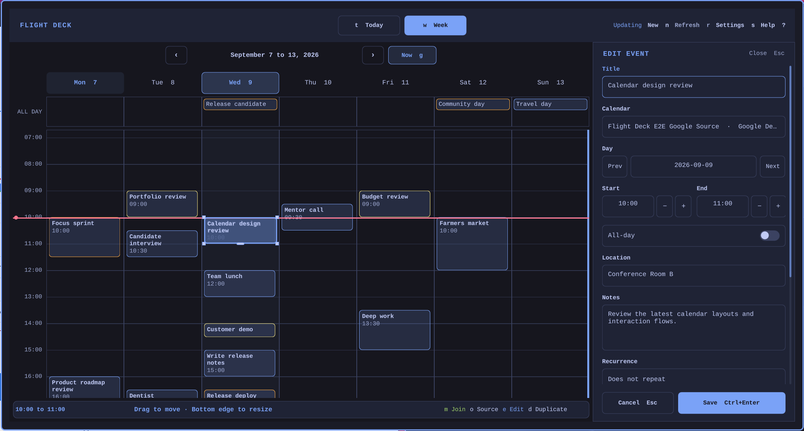

# Flight Deck Calendar for Omarchy

Flight Deck Calendar puts Google Calendar and Outlook in one Omarchy panel. Accounts connect in the browser, and read-only access remains the default. Tokens stay in the system keyring, and the local cache stays on the workstation. Saved changes go directly to the selected provider. No hosted backend receives calendar data.

See the [product overview](https://calendar.pestorious.com/), read the [privacy policy](https://calendar.pestorious.com/privacy/), or download the [stable release](https://github.com/joryeugene/omarchy-calendar/releases/tag/v1.1.0).



The right-side editor keeps the Week grid visible while a local draft changes. Save sends the completed change directly to Google or Microsoft. Cancel leaves the provider unchanged.


The Week view places Google and Outlook events on the same time grid. It shows all-day events, overlapping meetings, current-time context, and keyboard navigation. Today presents the same calendars as an agenda with persistent event details and meeting actions.

## Install

Requirements: current Omarchy with shell plugins, Python 3.11 or newer, and `secret-tool` for provider tokens. Node.js is required only for development checks.

```bash
omarchy plugin add https://github.com/joryeugene/omarchy-calendar.git --enable
```

The plugin manager clones the self-contained plugin. It does not install a user systemd timer, copy a helper into `~/.local/bin`, or edit Hyprland.

To try the built-in offline dataset before connecting an account:

```bash
~/.config/omarchy/plugins/io.github.joryeugene.omarchy-calendar/calendarctl demo seed
```

`Super+Shift+C` is an optional launch binding. Installation never creates it automatically. See [the installation guide](docs/INSTALL.md) for the exact binding setup.

## Connect Google and Outlook

Press `c`, choose Google Calendar or Outlook.com, review the requested read-only access, and choose **Connect in browser**. Complete provider consent in the browser, then return to Flight Deck. A successful first sync populates Today and Week.

Google requests identity plus `calendar.events.readonly` and `calendar.calendarlist.readonly`. Personal Outlook.com uses Microsoft `/consumers` and requests identity, profile, offline access, `User.Read`, and `Calendars.Read`. Both accounts are read-only by default.

### Advanced provider override

Contributors can replace either bundled public desktop registration without changing source code. A valid local override always takes precedence, and updates do not replace existing tokens or provider settings.

For Google, import the Desktop credentials JSON from a separate Google Cloud project:

```bash
calendarctl import-google-desktop-app /path/to/google-desktop-credentials.json
calendarctl auth google
```

The import stores the Google client ID in local provider settings and the Desktop app credential in Secret Service. It never writes the credential to the repository or dotfiles. For Microsoft, configure the public Application client ID from a personal-account capable desktop registration:

```bash
calendarctl configure-client microsoft PUBLIC_MICROSOFT_DESKTOP_ID
calendarctl auth microsoft
```

After an override is configured, connect through the same browser flow. See [the installation guide](docs/INSTALL.md) for the exact setup and removal behavior.

## Optional event editing

Event editing is opt-in for each account. Existing accounts and new connections remain read-only until the user chooses **Enable editing** in **Accounts and Calendars**. Google then requests `calendar.events.owned`; Outlook requests `Calendars.ReadWrite`. A blocked create, edit, duplicate, or quick-move action opens that exact account action and resumes after successful consent.

The Week view can create, edit, duplicate, move, resize, and delete events on calendars that the connected account owns. Only changes confirmed with Save are sent to the provider. Deletion always requires confirmation.

New events can repeat daily, on weekdays, weekly, monthly, or on selected weekdays. A series can continue indefinitely, stop after a set number of events, or end on a date. For an existing recurring event, choose **This occurrence** or **Entire series**. **This and following** is not supported.

An **Entire series** copy transfers the supported base schedule. Flight Deck checks the source series for modified or cancelled occurrences before offering Delete original. It offers Delete original only when the scan is complete and finds none; otherwise, it keeps the original series and explains why.

When copying an event, choose whether to keep the existing meeting link or generate a new meeting supported by the destination calendar. Flight Deck verifies the saved event before presenting the result. If the provider has not returned a generated link yet, Flight Deck reports that the meeting link is still pending and leaves the original event unchanged.

Events with attendees are duplicate-only in this release. Flight Deck does not edit, delete, or send invitations for them.

Changing the calendar while editing creates and verifies a copy in the destination calendar. Copying an event to another calendar does not delete the original event. Flight Deck offers Delete original only when the source is eligible for deletion, online, and authorized for event editing. Otherwise, both events remain, and the result explains why.

For a cross-provider copy, the selected event fields are sent directly from the workstation to the destination provider. No event data passes through a Flight Deck server.

Dragging and resizing change only the local draft. The unsaved draft remains available while the provider is offline, but Save stays disabled. If the event changed remotely, Flight Deck refreshes the provider event and preserves the local draft for review. If a create request is retried, Flight Deck reuses the same provider request identifier so the retry does not create a second event.

The same permission upgrade is available from the terminal:

```bash
calendarctl enable-editing google
calendarctl enable-editing microsoft
```

## Keyboard map

| Key | Action |
| --- | --- |
| `t` / `w` | Today / Week |
| `h` / `l` | Move across overlapping Week cards, then to the previous / next day; move between Settings sections |
| `j` / `k` | Move down / up through Week events, including the all-day lane |
| `[` / `]` | Previous / next day or week |
| `g` | Go to Now, select the current or nearest event, and reveal it |
| `Enter` | Expand or collapse selected details; activate a setting |
| `m` | Open the selected meeting link |
| `o` | Open the source event at Google or Outlook |
| `n` | Create an event at the selected day and time |
| `e` | Edit the selected event |
| `d` | Duplicate the selected event into a local draft |
| `Shift+H` / `Shift+L` | Open or move the local draft one day earlier / later |
| `Shift+J` / `Shift+K` | Open or move a timed local draft 15 minutes later / earlier |
| `h` / `l` in the editor | Change the selected field value |
| `j` / `k` in the editor | Move between fields |
| `Enter` in the recurring editor | Choose This occurrence or Entire series; reveal or confirm Delete |
| `Ctrl+Enter` in the editor | Save the current draft |
| `Esc` in the editor | Cancel Delete confirmation, then cancel the draft |
| `k` on a copy result | Keep both copies and close the result |
| `e` on a copy result | Enable editing for the source account when required |
| `x` on a copy result | Reveal, then confirm Delete original |
| `r` | Refresh providers |
| `c` | Open Settings at Calendars |
| `s` | Open Settings at Appearance |
| `a` in Settings | Apply the previewed settings |
| `?` | Toggle help |
| `Escape` | Cancel confirmation, cancel Settings, close an overlay, then close Flight Deck |

No shortcut requires Alt or number keys.

## Today focus and meeting actions


Select a video call to keep its details visible and open its meeting link with `m`.

## Settings and themes

Press `s` for Settings. Changes preview immediately. `Apply` persists them through Omarchy inline plugin settings. `Cancel` restores the exact prior appearance. Compact density shows substantially more rows; Roomy uses larger rows, gaps, and grid hours. Animations is a plain On or Off choice.

Press `c` for Calendars. Google and Outlook calendars are grouped by provider, and each cached calendar has a Shown or Hidden control plus provider-level Show all and Hide all actions. Hiding a calendar affects Today and Week immediately but does not disconnect it or stop synchronization, so showing it again is instant.

Both Today and Week also expose clickable previous, next, and Now controls. Previous and next move one day in Today or one week in Week. Now returns to the current day and week, selects the current or nearest event, and scrolls it fully into view.

Included themes:

- Kinetic Tokyo Night, the default
- Follow Omarchy, using active shell colors
- High Contrast, with stronger borders and color-independent focus


## Configuration reference

These keys belong on the `io.github.joryeugene.omarchy-calendar` bar entry in `~/.config/omarchy/shell.json`:

| Key | Values | Default | Purpose |
| --- | --- | --- | --- |
| `theme` | `kinetic-tokyo-night`, `omarchy`, `high-contrast` | `kinetic-tokyo-night` | Color preset |
| `density` | `compact`, `roomy` | `compact` | Clearly distinct calendar row, gap, and grid-hour sizing |
| `textScale` | `0.90` through `1.25` | `1.0` | Calendar panel type scale |
| `animations` | `true`, `false` | `true` | Enable or disable short color transitions |
| `defaultView` | `today`, `week` | `today` | View selected when the plugin loads |
| `weekStartHour` | `0` through `22` | `7` | First visible grid hour |
| `weekEndHour` | at least two hours after start, maximum `24` | `20` | Last visible grid hour |
| `timeFormat` | `system`, `12h`, `24h` | `system` | Event time display preference |
| `syncIntervalMinutes` | `5`, `15`, `30` | `5` | Singleton service refresh interval |
| `format` | Qt date-time format string | `yyyy/MM/dd HH:mm` | Horizontal bar label |
| `formatAlt` | Qt date-time format string | `dddd yyyy/MM/dd HH:mm` | Alternate horizontal label |
| `verticalFormat` | Qt date-time format string | stacked date and time | Vertical bar label |
| `verticalFormatAlt` | Qt date-time format string | stacked weekday, date, and time | Alternate vertical label |
| `hiddenCalendars` | array of opaque 64-character selector keys | `[]` | Calendars hidden locally from Today and Week |

Example:

```json
{
  "id": "io.github.joryeugene.omarchy-calendar",
  "theme": "kinetic-tokyo-night",
  "density": "compact",
  "textScale": 1,
  "animations": true,
  "defaultView": "today",
  "weekStartHour": 7,
  "weekEndHour": 20,
  "timeFormat": "system",
  "syncIntervalMinutes": 5,
  "format": "yyyy/MM/dd HH:mm",
  "hiddenCalendars": []
}
```

## Storage and privacy

- OAuth tokens: Secret Service system keyring
- Bundled provider registrations: public desktop application metadata shipped with the plugin
- Imported Google Desktop app credential for an advanced override: distinct Secret Service keyring item
- Calendar cache: `~/.local/state/omarchy-calendar/calendar.db`, mode `0600`
- Calendar visibility: opaque local selector keys in the Omarchy inline settings; names and account IDs remain in the local cache
- Optional local developer client IDs: `~/.config/omarchy-calendar/providers.json`, mode `0600`
- Telemetry, analytics, AI, and hosted backend: none
- Calendar writes: disabled until the account opts in; only an explicit Save sends a change
- Cross-provider copies: selected event fields go directly to the destination provider; no Flight Deck server receives them

Disconnect removes that provider's tokens and cached events immediately. `Reset local data` uses two-step confirmation and removes every provider token, cached event, health record, and local provider override while preserving appearance settings. Bundled public registration metadata remains part of the installed plugin. Read [PRIVACY.md](PRIVACY.md) for the complete lifecycle.

## Troubleshooting

Run the self-contained helper by absolute path:

```bash
plugin="$HOME/.config/omarchy/plugins/io.github.joryeugene.omarchy-calendar"
"$plugin/calendarctl" status
"$plugin/calendarctl" setup-status
omarchy plugin validate "$plugin"
hyprctl configerrors
omarchy-shell shell ping
```

If sync is offline, Flight Deck keeps the last good local cache and labels it stale. If a meeting or source button is disabled, the selected event did not provide a safe HTTPS target.

## Uninstall and delete local data

First erase tokens, provider overrides, and cache data:

```bash
~/.config/omarchy/plugins/io.github.joryeugene.omarchy-calendar/calendarctl reset-local-data
```

Then remove the plugin through Omarchy:

```bash
omarchy plugin remove io.github.joryeugene.omarchy-calendar
```

Remove an optional user-created `Super+Shift+C` binding separately. Uninstall does not alter Google or Microsoft calendars.

## Development

Run the complete local check:

```bash
just check
```

Optionally enable the repository's staged secret scan:

```bash
mise install
git config core.hooksPath .githooks
```

Before a public artifact or tag, run:

```bash
just release
```

Flight Deck Calendar is licensed under GPL-3.0-or-later. Contributions should retain SPDX headers, the read-only default, and the local-storage constraints.
